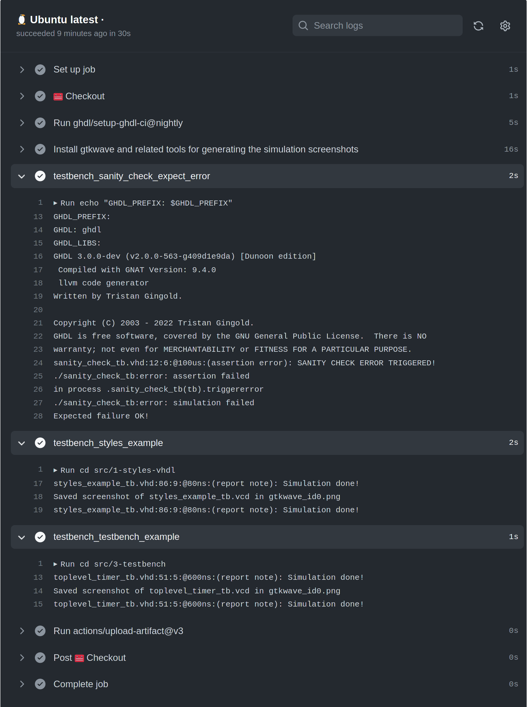

# fpga_tutorial
Collecting small FPGA examples as a tutorial
## TOC
* [Example showing different coding styles of VHDL, on a small SOP](src/1-styles-vhdl)
* [Example on how to create a testbench for simulations, on a monostable multivibrator (one-shot timer)](src/3-testbench)
## GHDL github Actions
Added [github actions CI jobs](https://github.com/naelolaiz/fpga_tutorial/actions) for simulating the examples with GHDL!


### Github-actions auto-generate logic diagrams of VHD files entities
Each gitlab job creates a diagram of the indicated entities, and publishes the generated .svg diagrams as artifacts.


### Github-actions auto-generate simulation signals views
Each gitlab job creates a screenshot of gtkwave showing the signals, and it is upload as an artifact:


* code adapted from https://github.com/ponty/sphinxcontrib-gtkwave to generate screenshots of the simulation with gtkwave ([adapted code](scripts/gtkwave_export.py))
* .vcd file for gtkwave generated as
```
ghdl -a input_tb.vhd
ghdl -e input_tb
ghdl -r input_tb --vcd=output.vcd
```
Alternatives for gtkwave
 * [sigrok](https://sigrok.org/wiki/Main_Page)
   * includes command line interface
 * [PulseView](https://sigrok.org/wiki/PulseView) (Qt frontend for sigrok)
   * includes serial bus decoders! (I guess sigrok already have them)

 * vscode + [teroshdl](https://github.com/TerosTechnology/vscode-terosHDL) internal viewer

