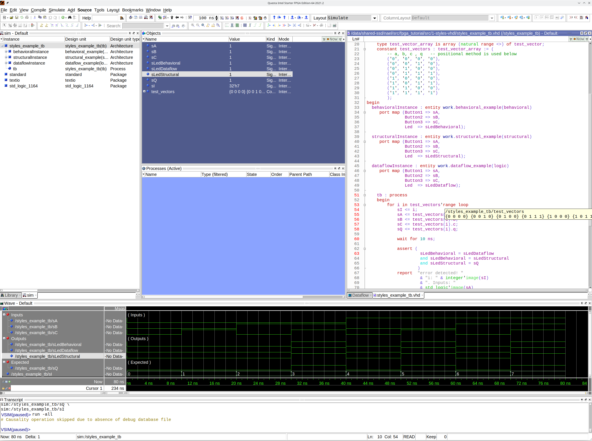

# Example showing different coding styles of VHDL 
Let's say we want to implement a logic that turns on a LED only when either two buttons are ON, OR a third button is ON. Which is a very basic form of [SOP](https://www.electronics-tutorials.ws/boolean/sum-of-product.html).

Since **our board has the led and the buttons active LOW**, we want to invert all the three button inputs and led outputs.
## Required logic diagram

## Truth table
| **Button1** | **Button2** | **Button3** | not Button1 | not Button2 | AND output | not Button3 | OR output | **Final OUTPUT** |
|-------------|-------------|-------------|-------------|-------------|------------|-------------|-----------|------------------|
| **1**       | **1**       | **1**       | 0           | 0           | 0          | 0           | 0         | **1**            |
| **1**       | **1**       | **0**       | 0           | 0           | 0          | 1           | 1         | **0**            |
| **1**       | **0**       | **1**       | 0           | 1           | 0          | 0           | 0         | **1**            |
| **1**       | **0**       | **0**       | 0           | 1           | 0          | 1           | 1         | **0**            |
| **0**       | **1**       | **1**       | 1           | 0           | 0          | 0           | 0         | **1**            |
| **0**       | **1**       | **0**       | 1           | 0           | 0          | 1           | 1         | **0**            |
| **0**       | **0**       | **1**       | 1           | 1           | 1          | 0           | 1         | **0**            |
| **0**       | **0**       | **0**       | 1           | 1           | 1          | 1           | 1         | **0**            |
## Four ways to implement the same logic, resulting in the same internal implementation
 * [by a circuit diagram / netlist (Led1)](diagram_example.bdf) In this case, use as top-level construct as well, instantiating all examples.
 * [by defining the data flow, with assingnments (Led2)](dataflow_example.vhd)
 * [by defining the expected behavior, with processes and sequential definitions (Led3)](behavioral_example.vhd)
 * [by defining the structure of instances of entities/components/primitives (Led4)](structural_example.vhd)
## Top-level circuit diagram

## Testbench added!
Using the truth table:

