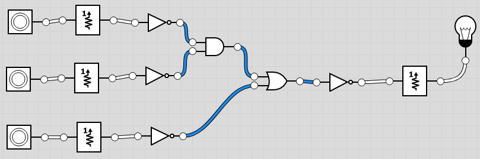

# Example showing different coding styles of VHDL 
Let's say we want to implement a logic that turns on a LED only when either two buttons are ON, OR a third button in ON.
And since our board has the led and the buttons active LOW, we want to invert all the three button inputs and led outputs.
## Required logic diagram

## Four ways to implement the same logic, resulting in the same internal implementation
 * [by a circuit diagram (Led1)](diagram_example.bdf) In this case, use as top-level construct as well, instantiating all examples.
 * [by defining the data flow, with assingnments (Led2)](dataflow_example.vhd)
 * [by defining the expected behavior, with processes and sequential definitions (Led3)](behavioral_example.vhd)
 * [by defining the structure of instances of entities/components/primitives (Led4)](structural_example.vhd)
## Top-level circuit diagram

