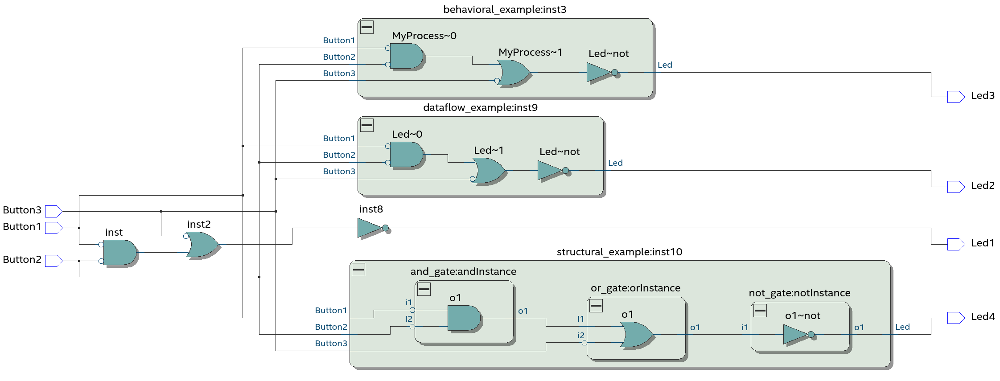

# Example showing different coding styles of VHDL 

## Four ways to apply the same binary logic, resulting in the same internal implementation
 * [by defining the structure of instances of entities/components (Led4)](structural_example.vhd)
 * [by defining the data flow, with assingnments (Led2)](dataflow_example.vhd)
 * [by defining the expected behavior, with processes and sequential definitions (Led3)](behavioral_example.vhd)
 * [by a circuit diagram (Led1)](diagram_example.bdf) In this case, use as top-level construct as well, instantiating all examples.

## Top-level circuit diagram

