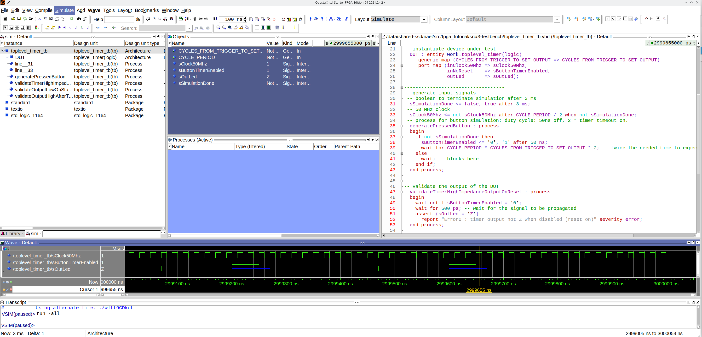

#  Example on how to create a testbench for simulations
Example of testbench of a top-level entity using a single one-time-shot timer
## Explanation of the code
 * for the testbench we use a portless entity 
```
-- test bench level entity
entity toplevel_timer_tb is
end;
```
 * we use signals to check states from the simulator environment
``` 
architecture tb of toplevel_timer_tb is
 --[...]
 -- signals for inputs
  signal sClock50Mhz         : std_logic := '0';
  signal sButtonTimerEnabled : std_logic := '1';
 -- signals for outputs
  signal sOutLed             : std_logic ; 
```
 * in this example we use an extra boolean signal to stop the simulation
```
  signal sSimulationDone : boolean := false;
```
* then we instantiate the entity we want to test
```
DUT : entity work.toplevel_timer(logic)
   generic map (CYCLES_FROM_TRIGGER_TO_SET_OUTPUT => CYCLES_FROM_TRIGGER_TO_SET_OUTPUT)
   port map (inClock50Mhz => sClock50Mhz,
             inNoReset    => sButtonTimerEnabled, 
             outLed       => sOutLed);
```
* then generate the clock
```
sClock50Mhz <= not sClock50Mhz after CYCLE_PERIOD / 2 when not sSimulationDone;
``` 
* and the input button simulation, using a process
```
  generatePressedButton : process 
  begin
    sButtonTimerEnabled <= '0';
    wait for BUTTON_LOW_TIME;
    sButtonTimerEnabled <= '1';
    wait for BUTTON_HIGH_TIME_INCLUDING_TRIGGER;
    sButtonTimerEnabled <= '0';
    wait for BUTTON_LOW_TIME;
    sButtonTimerEnabled <= '1';
    wait for BUTTON_HIGH_TIME_BEFORE_TRIGGER;
    sButtonTimerEnabled <= '0';
    sSimulationDone <= true;
    wait; -- blocks here
  end process;
```
 * then we create process for our tests
```
-- High impedance output when reset enabled
  validateTimerHighImpedanceOutputOnReset : process 
  begin
    wait until sButtonTimerEnabled = '0';
    wait for MIN_DELTA; -- wait for the signal to be propagated
    assert (sOutLed = 'Z')
      report "Timer output not Z when disabled (reset on)" severity error;
  end process;
-- Start timer makes output low
  validateOutputLowOnStartTimer : process 
  begin
    wait until rising_edge(sButtonTimerEnabled);
    wait until rising_edge(sClock50Mhz);
    wait for MIN_DELTA; -- wait for the signal to be propagated
    assert (sOutLed = '0')
      report "Timer output not 0 after a fresh reset" severity error;
  end process;
-- Triggered timer makes output high
  validateOutputHighAfterTimerDone : process
   -- expected time for the output to be 1 (until high impedance)
    constant cExpectedTimeForHighIncludingTrigger : time := BUTTON_HIGH_TIME_INCLUDING_TRIGGER - (TIMER_TIME_FOR_TRIGGER + CYCLE_PERIOD);
   -- used to measure timer LOW time
    variable vTimestampLastLow    : time := 0 ns;
   -- used to measure timer HIGH time
    variable vTimestampLastHigh   : time := 0 ns;
  begin
    wait until sOutLed = '0';
    vTimestampLastLow := now; -- to check timing in low
    wait until rising_edge(sClock50Mhz);
    wait until sOutLed = '1';
    vTimestampLastHigh := now; -- to check timing in high
   -- check that the timer was triggered on time
    assert (abs((now - vTimestampLastLow) - TIMER_TIME_FOR_TRIGGER) < MIN_DELTA)
      report "Timer output not 1 after timeout period" severity error;
   -- check that the output is still 1 after four clocks
    for counter in 1 to 4 loop
       wait until rising_edge(sClock50Mhz);
       assert (sOutLed = '1')
         report "Timer output not kept 1 after timeout period" severity error;
     end loop;
   -- check that is still high until it changes to high impedance
    wait until sOutLed = 'Z';
    assert (abs((now - vTimestampLastHigh) - cExpectedTimeForHighIncludingTrigger) < MIN_DELTA + (CYCLE_PERIOD / 2)) -- we have half a cycle of uncertainty
      report "Error4 : timer output not 1 long enough" severity error;
  end process;
 ```
 ## Questa Simulation
 * Loop with repetitive signal
  
 * Simplified signal
  
